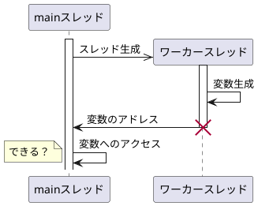

# ワーカースレッド（あるいはゴルーチン）で生成された値の破棄タイミング

```plantuml
@startuml

participant mainスレッド as main
participant ワーカースレッド as work

activate main
main ->> work ** : スレッド生成
activate work
work -> work : 変数生成
work -> main : 変数のアドレス
destroy work
main -> main : 変数へのアクセス
note left : できる？

@enduml
```
